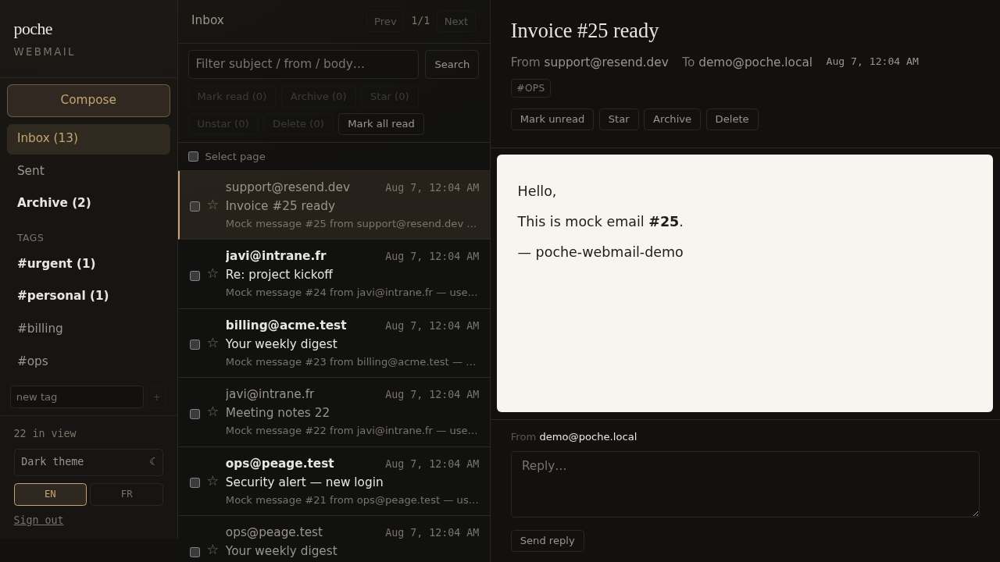
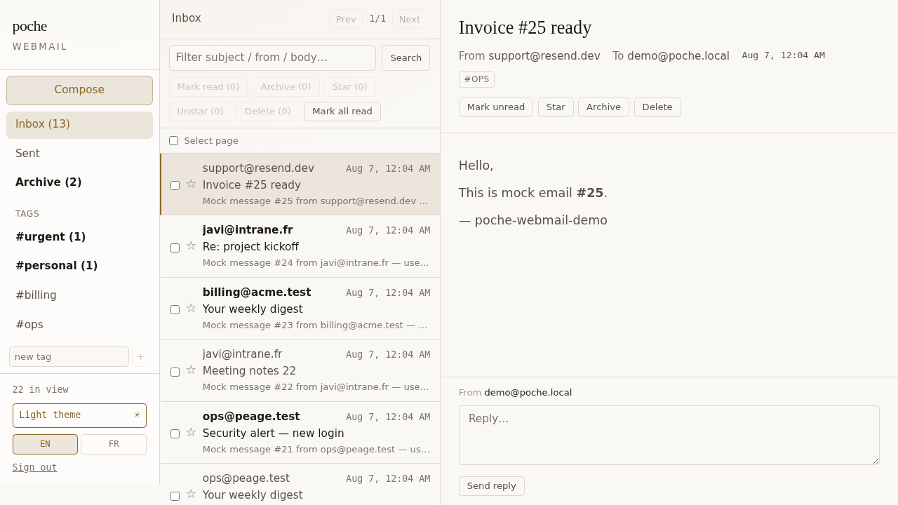
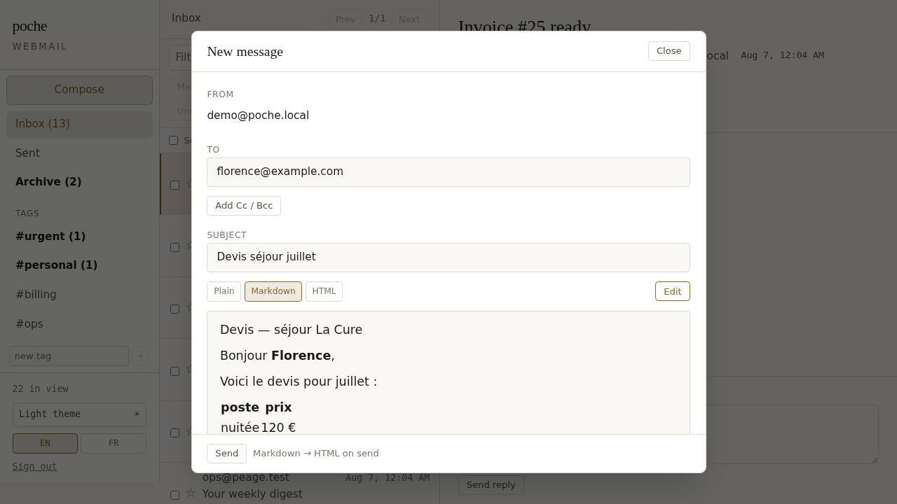
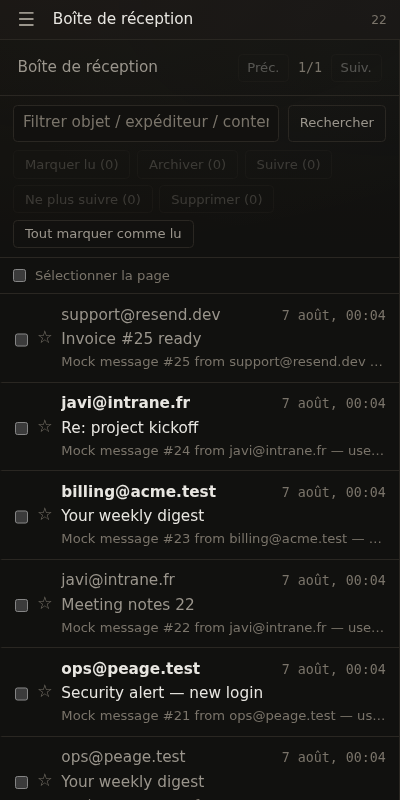

# poche-resend-webmail

**A self-hosted mailbox on top of [Resend](https://resend.com).** One small Go
binary, a webmail UI, and a store you can grep. MIT.

If you already send transactional mail through Resend and want a real inbox on
your domain — `contact@yourdomain.com`, in a browser, without running Postfix
and Dovecot or paying per seat — this is that.



## Try it in one command

```bash
git clone https://github.com/javimosch/poche-resend-webmail
cd poche-resend-webmail
./bootstrap.sh
```

That downloads the two binaries, initialises the store, seeds 25 fake messages
and prints a URL. No Resend account needed to look around. Everything lands in
`./.webmail`; delete that directory and nothing remains.

```bash
./bootstrap.sh live     # ask for a Resend key and a domain, for a real mailbox
./bootstrap.sh stop     # stop both processes
```

Needs Linux/amd64 for the prebuilt `poche` binary. On other platforms, build
[poche](https://github.com/javimosch/poche) yourself and pass
`POCHE_BIN=/path/to/poche`.

## What it does

| | |
|---|---|
| **Receive** | Resend delivers inbound mail to a webhook; signatures verified (Svix), HTML sanitized before storage |
| **Send** | Compose in plain text, Markdown or HTML, with attachments; reply with threading headers |
| **Organise** | Tags, archive, star, search, bulk actions, retention with quotas |
| **Multi-tenant** | Several mailboxes, each with its own domain, Resend account, branding and quota |
| **Speak** | English and French UI, light and dark themes, usable on a phone |
| **Automate** | Every operation has a CLI with JSON output — provisioning, sending, syncing |

<p align="center">
  
  
</p>

## How it fits together

```
    inbound mail ──▶ Resend ──webhook──▶ ┌──────────────┐
                                          │   Go BFF     │  auth, sanitizing,
    browser / CLI ──────────────────────▶ │ (this repo)  │  send, webhook verify
                                          └──────┬───────┘
                                                 │ HTTP
                                          ┌──────▼───────┐
                                          │    poche     │  documents, search,
                                          │   (store)    │  tags, links
                                          └──────────────┘
```

- **Resend is transport only** — receiving and sending. No mail is stored there.
- **[poche](https://github.com/javimosch/poche) is the store.** Inbox and
  Archive are not folders but join filters (`missing_link` / `has_link` on a
  tag), so a message can carry many labels without duplication.
- **The browser only ever talks to the BFF.** Resend keys and store tokens stay
  on the server.

## Running it for real

1. **Verify a domain in Resend** and enable receiving. Their auto-configure
   writes the MX, DKIM and SPF records for you.
2. **Point a webhook** (event `email.received`) at
   `https://your-host/webhooks/resend`, then store its signing secret:
   ```bash
   printf 'whsec_…' | ./poche-resend-webmail mailbox update \
     --address you@yourdomain.com --resend-webhook-secret -
   ```
3. **Create a mailbox** someone can log into:
   ```bash
   ./poche-resend-webmail mailbox create \
     --address you@yourdomain.com --password - \
     --recovery-email backup@elsewhere.com \
     --alias "hello@yourdomain.com,info@yourdomain.com" \
     --max-bytes 262144000
   ```
4. Put it behind TLS (Caddy, Traefik, nginx — the BFF speaks plain HTTP).

### Hosting mailboxes for several clients

One deployment can serve several domains, each on its own Resend account:

```bash
printf 're_…'    | ./poche-resend-webmail mailbox update --address contact@client.fr --resend-key -
printf 'whsec_…' | ./poche-resend-webmail mailbox update --address contact@client.fr --resend-webhook-secret -
./poche-resend-webmail mailbox update --address contact@client.fr \
  --brand "Client Co" --webmail-url https://mail.client.fr
```

Sending, webhook verification and content fetching all resolve per mailbox, so
one client's key is never used for another's mail. Credentials are encrypted at
rest under `CREDENTIALS_KEY` — poche stores documents in the clear, so without
it any copy of the database carries live API keys.

<p align="center"></p>

## Agent-friendly

Every operation is a subcommand with JSON on stdout and events on stderr:

```bash
./poche-resend-webmail send --to a@b.fr --subject Devis \
  --format markdown --text "# Bonjour\n\n**devis** ci-joint" --attach ./devis.pdf
./poche-resend-webmail mailbox list
./poche-resend-webmail guide          # machine-readable description of the tool
```

Secrets are read from stdin (`-`) or the environment (`env:NAME`), never argv,
so they stay out of `ps` and shell history.

## Security posture

- Webhook signatures verified per Svix, with a 5-minute replay window.
- Inbound HTML sanitized before storage (bluemonday); attachments always
  download with `nosniff` and a sandbox CSP, so an HTML or SVG attachment
  cannot execute in the mailbox origin.
- Attachment access is scoped to the owning mailbox.
- Passwords are bcrypt; sessions expire; per-mailbox Resend credentials are
  AES-256-GCM encrypted at rest.

Found a hole? Open an issue — this runs real mail for real people, so a
security report beats a polite silence.

## Honest limitations

- **Inbound attachments arrive as names without content.** Resend's webhook
  payload carries no bytes or URL, and fetching the full message needs a
  read-capable API key. Being worked on.
- **`sync` needs that same read access**, so webhook delivery is currently the
  only ingest path.
- **Retention is stated but not enforced automatically** — `cleanup` runs when
  you invoke it. And `retention_months: 0` means "inherit the default", not
  "keep forever".
- **Attachment bytes live on the host filesystem**, not in poche (poche holds
  documents in memory). Back up `BLOB_DIR` alongside `poche.data`.
- **No high availability.** One store, one process, one disk. Fine for a
  handful of mailboxes; do not put a hospital on it.
- poche's API has sharp edges this project works around — see
  [AGENTS.md](AGENTS.md) for the ones that cost real debugging time.

## Documentation

- [AGENTS.md](AGENTS.md) — architecture, every env var, and the traps
- [CHANGELOG.md](CHANGELOG.md) — what changed and what is still missing

MIT.
